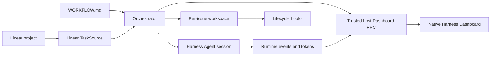

# dsh-dashboard

English | [简体中文](https://github.com/Uddoo/dsh-dashboard/blob/v0.1.0/README.zh-CN.md)

`dsh-dashboard` is a Symphony-compatible issue orchestrator and operations dashboard for [DeepSeek Harness](https://github.com/deepseek-ai/deepseek-harness). It turns Linear issues into isolated Harness Agent runs while preserving the native Harness shell, sidebar, sessions, tools, model selection, and permission system.


## Highlights

- Reads a `WORKFLOW.md` with YAML frontmatter and a Liquid prompt. Invalid hot reloads are rejected while the last valid definition remains active.
- Polls Linear, resolves blocking relations, applies global and per-state concurrency limits, and dispatches eligible work in deterministic order.
- Creates one persistent workspace per issue and runs configurable `after_create`, `before_run`, `after_run`, and `before_remove` lifecycle hooks.
- Runs work through the native Harness Agent and continues the same Harness session for up to the configured turn limit.
- Retries failed runs with bounded exponential backoff and reconciles task state before every dispatch cycle.
- Adds a native **Dashboard** entry to the Harness sidebar. Board, Runtime, and Configuration views expose task state, sessions, workspaces, turns, token usage, recent Agent events, retries, and blockers.
- Keeps Linear credentials on the trusted Host side; secrets are never sent through Dashboard RPC or rendered in the browser.

The `Linear · ENG` control beside the Dashboard title is dynamic task-source context. Both the provider label and project label come from the active configuration.

## How it works



The Host plugin owns tracker access, scheduling, workspaces, hooks, Agent sessions, and runtime state. The browser client receives a constrained projection of that state and exposes only bounded operations such as Pause/Resume, Stop, and Refresh.

## Requirements

- Node.js `22.19+` or `24+`
- pnpm `11.19+`
- DeepSeek Harness Web profile `0.1.0-rc.5` or `0.1.0-rc.6`
- A Linear Personal API Key
- An existing Harness permission preset; the bundled configuration uses `workspace-write`

The repository is compiled and tested against the npm-published Harness `0.1.0-rc.6` packages. See [Compatibility](https://github.com/Uddoo/dsh-dashboard/blob/v0.1.0/docs/compatibility.md) for the audited Harness interfaces and version boundary.

## Install

### Install from npm

Install the prebuilt package into the Harness Web profile:

```powershell
dsh plugin --profile web add dsh-dashboard@0.1.0
dsh web --dump-config
dsh web
```

If the CLI is not installed globally:

```powershell
npx --yes @deepseek-ai/dsh@0.1.0-rc.6 plugin --profile web add dsh-dashboard@0.1.0
npx --yes @deepseek-ai/dsh@0.1.0-rc.6 web --dump-config
npx --yes @deepseek-ai/dsh@0.1.0-rc.6 web
```

The npm package contains prebuilt Host and Client entry points and does not require an install-time build allowance.

### Build from source or create a tarball

Run these commands from the repository root in PowerShell:

```powershell
pnpm install --ignore-scripts
pnpm run typecheck
pnpm test
pnpm run build
Copy-Item -LiteralPath WORKFLOW.example.md -Destination WORKFLOW.md
pnpm pack
```

Install the generated package into the Harness Web profile:

```powershell
dsh plugin --profile web add ./dsh-dashboard-0.1.0.tgz
dsh web --dump-config
dsh web
```

If the CLI is not installed globally, use the npm package directly:

```powershell
npx --yes @deepseek-ai/dsh@0.1.0-rc.6 plugin --profile web add ./dsh-dashboard-0.1.0.tgz
npx --yes @deepseek-ai/dsh@0.1.0-rc.6 web --dump-config
npx --yes @deepseek-ai/dsh@0.1.0-rc.6 web
```

### Install from GitHub

Pin the installation to a release tag so later repository changes cannot silently alter the code executed during installation:

```powershell
dsh plugin --profile web add github:Uddoo/dsh-dashboard#v0.1.0
```

Git installations fetch source code, so pnpm must run this package's `prepare` script to build `lib/`. pnpm 10 and newer require explicit permission before running dependency build scripts. If the first install reports a blocked build, copy the **exact package key printed by pnpm** into the Web profile's `$DSH_HOME/profiles/web/pnpm-workspace.yaml`, then repeat the command. GitHub tags resolve to commit-specific codeload URLs, so a package-name-only key is not sufficient:

```yaml
allowBuilds:
  dsh-dashboard@https://codeload.github.com/Uddoo/dsh-dashboard/tar.gz/<resolved-commit-sha>: true
```

Granting `allowBuilds` permits package code to execute on the local machine during installation. Review the pinned source before enabling it. To avoid install-time builds, use the npm package or download the prebuilt [v0.1.0 release tarball](https://github.com/Uddoo/dsh-dashboard/releases/download/v0.1.0/dsh-dashboard-0.1.0.tgz).

Open the URL printed by `dsh web`, then select **Dashboard** in the native Harness sidebar.

To uninstall the plugin:

```powershell
dsh plugin --profile web remove dsh-dashboard
```

## Plugin configuration

The package contributes a standard `dsh.bundle.patch`. Its defaults are defined in [cordis.patch.yml](https://github.com/Uddoo/dsh-dashboard/blob/v0.1.0/cordis.patch.yml):

| Key | Purpose |
| --- | --- |
| `workflowPath` | Path to `WORKFLOW.md`, resolved from the Harness process working directory unless absolute. |
| `permissionPreset` | Explicit Harness permission preset applied to every orchestrated Agent. This value is required. |
| `agentPreset` | Optional Harness Agent preset. When omitted, the available roster default is used. |
| `workerHost` | Host label shown in runtime observability. Defaults to `local`. |
| `linear.apiKeyRef` | Credential reference resolved by the Host. Defaults to `LINEAR_API_KEY`. |
| `linear.endpoint` | Linear GraphQL endpoint. Defaults to `https://api.linear.app/graphql`. |

Override the installed row in the Web profile's `cordis.patch.yml` when local paths or presets differ:

```yaml
- id: dsh-dashboard
  config:
    workflowPath: C:\work\my-project\WORKFLOW.md
    permissionPreset: workspace-write
    workerHost: workstation-01
    linear:
      apiKeyRef: LINEAR_API_KEY
      endpoint: https://api.linear.app/graphql
```

`permissionPreset` is deliberately explicit: unattended orchestration must not silently select or elevate a sandbox or approval policy.

## Linear credentials

Set the referenced environment variable before starting Harness:

```powershell
$env:LINEAR_API_KEY = 'lin_api_replace_me'
dsh web
```

Alternatively, place the credential in `$DSH_HOME/.credentials.yaml`:

```yaml
LINEAR_API_KEY: lin_api_replace_me
```

Do not commit that file, real tokens, or command output containing tokens. The plugin resolves the credential at the start of each Linear operation and does not write the secret into plugin configuration, logs, RPC payloads, or Dashboard state.

## WORKFLOW.md

Start with [WORKFLOW.example.md](https://github.com/Uddoo/dsh-dashboard/blob/v0.1.0/WORKFLOW.example.md). The YAML frontmatter controls tracker selection, polling, workspace behavior, lifecycle hooks, Agent limits, and visible board states. The Markdown body is rendered as the Agent prompt for each issue.

Important fields:

| Field | Description |
| --- | --- |
| `tracker.provider.project_slug` | Linear project slug, not its display name. |
| `tracker.provider.context_label` | Short project label displayed beside the Dashboard title, such as `ENG`. |
| `tracker.required_labels` | Labels that must all be present before an issue can be dispatched. |
| `tracker.active_states` | States eligible for Agent execution. |
| `tracker.terminal_states` | States that stop execution and trigger safe workspace cleanup. |
| `workspace.root` | Parent directory containing one persistent workspace per issue. |
| `hooks.timeout_ms` | Timeout applied to each lifecycle hook. |
| `agent.max_concurrent_agents` | Global Agent concurrency limit. |
| `agent.max_concurrent_agents_by_state` | Optional concurrency limits for individual tracker states. |
| `agent.max_turns` | Maximum number of turns continued in one Harness session. |
| `agent.max_retry_backoff_ms` | Upper bound for retry backoff. |
| `dashboard.visible_states` | Board columns displayed before the Hidden columns group. |

The Liquid prompt can use issue fields such as `issue.identifier`, `issue.title`, `issue.description`, `issue.state`, `issue.labels`, and `issue.url`, plus the current retry `attempt`.

### Lifecycle hooks

- `after_create` runs only after a new issue workspace is created.
- `before_run` runs before every Agent attempt.
- `after_run` runs after an Agent attempt while the workspace still exists.
- `before_remove` runs before terminal workspace cleanup.

Hooks execute as trusted local commands inside the issue workspace. Review them with the same care as build or deployment scripts.

## Scheduling and workspace safety

- Eligible issues are ordered by priority, creation time, and identifier.
- Unresolved Linear `blocks` relations prevent dispatch and appear as blockers in Dashboard state.
- Missing issues are stopped without being treated as terminal, so a transient tracker/query change does not delete their workspace.
- Workspace identifiers are normalized and containment-checked before filesystem mutation.
- Workspace roots and issue directories must be real directories, not symbolic links.
- Deletion targets are resolved again after `before_remove`; cleanup is refused if the root or target changed while the hook was running.
- A failed `after_create` removes the incomplete new workspace so a later attempt can initialize it again.
- Hook stdout and stderr are retained as bounded tails to prevent unbounded memory growth.

See [Security](https://github.com/Uddoo/dsh-dashboard/blob/v0.1.0/docs/security.md) and [Architecture](https://github.com/Uddoo/dsh-dashboard/blob/v0.1.0/docs/architecture.md) for the complete trust model and component boundaries.

## Dashboard

The plugin registers through Harness-native UI slots:

- `sidebar.footer.action` provides the Dashboard entry in the existing Harness sidebar.
- `shell.overlay` renders the Dashboard in the main Harness content area.

The plugin does not replace or duplicate the Harness sidebar.

Available views:

- **Board** — Linear-style task columns, hidden states, filtering, display controls, and issue inspection.
- **Runtime** — running, retrying, and blocked records with turns, token usage, worker host, and update time.
- **Configuration** — the active last-good workflow, tracker context, credential status, workspace root, polling interval, permission preset, and Agent limits.

## Development and verification

```powershell
pnpm run typecheck
pnpm test
pnpm run build
```

For deterministic component development:

```powershell
pnpm run dev:dashboard
```

Open `http://127.0.0.1:4173/dev/`. This page uses local fixtures and is useful for component-level visual and interaction checks. It does not connect to Linear and is not evidence that the packaged plugin loads correctly in Harness.

Integration verification should install the generated package, start `dsh web`, enter Dashboard from the native Harness sidebar, and check rendered state, interactions, browser console output, and Host logs.

Design references are kept in [docs/design](https://github.com/Uddoo/dsh-dashboard/blob/v0.1.0/docs/design/README.md).

## Relationship to Symphony

This project reproduces Symphony's orchestration contract rather than embedding its Elixir/OTP implementation:

- `TaskSource` provides the tracker boundary.
- `HarnessAgentRunner` maps Agent execution and continuation onto native Harness sessions.
- Persistent per-issue workspaces and lifecycle hooks follow Symphony-compatible semantics with additional fail-closed filesystem checks.
- Trusted-host RPC projects observable state and a small set of runtime controls into the Dashboard.
- The UI combines Symphony's operational signals with a Linear-style board inside the native Harness shell.

Upstream reference: [openai/symphony](https://github.com/openai/symphony).

## License

[MIT](https://github.com/Uddoo/dsh-dashboard/blob/v0.1.0/LICENSE)
