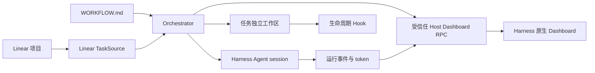

# dsh-dashboard

[English](https://github.com/Uddoo/dsh-dashboard/blob/v0.1.0/README.md) | 简体中文

`dsh-dashboard` 是一个面向 [DeepSeek Harness](https://github.com/deepseek-ai/deepseek-harness) 的 Symphony 兼容任务编排器与运行看板。它将 Linear 任务转换为相互隔离的 Harness Agent 运行，同时保留 Harness 原生的外壳、侧栏、会话、工具、模型选择和权限系统。


## 主要能力

- 读取包含 YAML frontmatter 和 Liquid prompt 的 `WORKFLOW.md`；无效热更新会被拒绝，最后一个有效定义继续生效。
- 轮询 Linear、解析任务阻塞关系、执行全局及按状态并发限制，并以确定性顺序派发符合条件的任务。
- 为每个任务创建持久工作区，并执行可配置的 `after_create`、`before_run`、`after_run` 和 `before_remove` 生命周期 Hook。
- 通过 Harness 原生 Agent 执行任务，并在配置的 turn 上限内续跑同一个 Harness session。
- 对失败运行执行有上限的指数退避，并在每次派发前重新核对任务状态。
- 在 Harness 原生侧栏中增加 **Dashboard** 入口；Board、Runtime 和 Configuration 视图展示任务状态、session、workspace、turn、token、最近 Agent 事件、重试与阻塞原因。
- Linear 凭据始终留在受信任的 Host 侧，不会经由 Dashboard RPC 发送，也不会渲染到浏览器中。

Dashboard 标题旁的 `Linear · ENG` 是动态任务源上下文，provider 名称和项目短标签均来自当前配置。

## 真实集成截图

这些截图来自加载 npm 已发布插件的真实 DeepSeek Harness Web profile，并连接到一次性 Linear 测试项目。Runtime 画面记录了原生 Harness Agent 刚完成派发时的活动 worker；Configuration 画面展示当前工作流边界，但不会暴露凭据值。

| Harness 原生 Agent Runtime | 当前工作流配置 |
| --- | --- |
|  |  |

## 工作原理



Host 插件负责 tracker 访问、调度、workspace、Hook、Agent session 和运行状态。浏览器客户端只接收经过约束的状态投影，并只提供 Pause/Resume、Stop、Refresh 等有限操作。

## 环境要求

- Node.js `22.19+` 或 `24+`
- pnpm `11.19+`
- DeepSeek Harness Web profile `0.1.0-rc.5` 或 `0.1.0-rc.6`
- Linear Personal API Key
- 一个已经存在的 Harness permission preset；随包配置使用 `workspace-write`

本仓库使用 npm 发布的 Harness `0.1.0-rc.6` 包进行编译和测试。已审核的 Harness 接口与版本边界见[兼容性说明](https://github.com/Uddoo/dsh-dashboard/blob/v0.1.0/docs/compatibility.md)。

## 安装

### 从 npm 安装

将预构建插件包安装到 Harness Web profile：

```powershell
dsh plugin --profile web add dsh-dashboard@0.1.0
dsh web --dump-config
dsh web
```

如果没有全局安装 CLI：

```powershell
npx --yes @deepseek-ai/dsh@0.1.0-rc.6 plugin --profile web add dsh-dashboard@0.1.0
npx --yes @deepseek-ai/dsh@0.1.0-rc.6 web --dump-config
npx --yes @deepseek-ai/dsh@0.1.0-rc.6 web
```

npm 包已经包含预构建的 Host 和 Client 入口，不需要授予安装时构建权限。

### 从源码构建或创建 tarball

在仓库根目录使用 PowerShell 执行：

```powershell
pnpm install --ignore-scripts
pnpm run typecheck
pnpm test
pnpm run build
Copy-Item -LiteralPath WORKFLOW.example.md -Destination WORKFLOW.md
pnpm pack
```

将生成的插件包安装到 Harness Web profile：

```powershell
dsh plugin --profile web add ./dsh-dashboard-0.1.0.tgz
dsh web --dump-config
dsh web
```

如果没有全局安装 CLI，可以直接使用 npm 包：

```powershell
npx --yes @deepseek-ai/dsh@0.1.0-rc.6 plugin --profile web add ./dsh-dashboard-0.1.0.tgz
npx --yes @deepseek-ai/dsh@0.1.0-rc.6 web --dump-config
npx --yes @deepseek-ai/dsh@0.1.0-rc.6 web
```

### 从 GitHub 安装

安装时应锁定 release tag，避免仓库后续更新静默改变安装过程中执行的代码：

```powershell
dsh plugin --profile web add github:Uddoo/dsh-dashboard#v0.1.0
```

Git 安装获取的是源码，因此 pnpm 必须运行本包的 `prepare` 脚本来构建 `lib/`。pnpm 10 及以上版本在执行依赖构建脚本前要求显式授权。如果首次安装报告构建被阻止，请把 pnpm 输出的**完整 package key 原样复制**到 Web profile 的 `$DSH_HOME/profiles/web/pnpm-workspace.yaml`，然后重新执行安装命令。GitHub tag 会解析为带 commit 的 codeload URL，因此只填写包名是不够的：

```yaml
allowBuilds:
  dsh-dashboard@https://codeload.github.com/Uddoo/dsh-dashboard/tar.gz/<resolved-commit-sha>: true
```

授予 `allowBuilds` 意味着允许插件包代码在安装期间于本机执行。启用前应审核锁定版本的源码。如果不希望安装时执行构建，可以使用 npm 包，或下载预构建的 [v0.1.0 release tarball](https://github.com/Uddoo/dsh-dashboard/releases/download/v0.1.0/dsh-dashboard-0.1.0.tgz)。

打开 `dsh web` 输出的地址，然后从 Harness 原生侧栏选择 **Dashboard**。

卸载插件：

```powershell
dsh plugin --profile web remove dsh-dashboard
```

## 插件配置

插件包提供标准 `dsh.bundle.patch`，默认值位于 [cordis.patch.yml](https://github.com/Uddoo/dsh-dashboard/blob/v0.1.0/cordis.patch.yml)：

| 配置项 | 用途 |
| --- | --- |
| `workflowPath` | `WORKFLOW.md` 的路径；相对路径从 Harness 进程工作目录解析，也可以使用绝对路径。 |
| `permissionPreset` | 应用于每个编排 Agent 的 Harness permission preset；该配置为必填项。 |
| `agentPreset` | 可选的 Harness Agent preset；省略时使用可用的 roster 默认值。 |
| `workerHost` | Runtime 观测信息中显示的 Host 标签，默认为 `local`。 |
| `linear.apiKeyRef` | 由 Host 解析的凭据引用，默认为 `LINEAR_API_KEY`。 |
| `linear.endpoint` | Linear GraphQL 地址，默认为 `https://api.linear.app/graphql`。 |

本机路径或 preset 不同时，可以在 Web profile 的 `cordis.patch.yml` 中覆盖已安装配置行：

```yaml
- id: dsh-dashboard
  config:
    workflowPath: C:\work\my-project\WORKFLOW.md
    permissionPreset: workspace-write
    workerHost: workstation-01
    linear:
      apiKeyRef: LINEAR_API_KEY
      endpoint: https://api.linear.app/graphql
```

`permissionPreset` 被设计为显式必填项：无人值守的编排不能静默选择或提升 sandbox/approval policy。

## Linear 凭据

启动 Harness 前设置被引用的环境变量：

```powershell
$env:LINEAR_API_KEY = 'lin_api_replace_me'
dsh web
```

也可以将凭据写入 `$DSH_HOME/.credentials.yaml`：

```yaml
LINEAR_API_KEY: lin_api_replace_me
```

不要把该文件、真实 token 或包含 token 的命令输出提交到 Git。插件会在每次 Linear 操作开始时解析凭据，不会把 secret 写入插件配置、日志、RPC payload 或 Dashboard 状态。

## WORKFLOW.md

可以从 [WORKFLOW.example.md](https://github.com/Uddoo/dsh-dashboard/blob/v0.1.0/WORKFLOW.example.md) 开始。YAML frontmatter 控制 tracker、轮询、workspace、生命周期 Hook、Agent 限制和可见看板状态；Markdown 正文会针对每个任务渲染为 Agent prompt。

重要字段：

| 字段 | 说明 |
| --- | --- |
| `tracker.provider.project_slug` | Linear 项目的 slug，而不是显示名称。 |
| `tracker.provider.context_label` | Dashboard 标题旁显示的项目短标签，例如 `ENG`。 |
| `tracker.required_labels` | 任务派发前必须全部存在的标签。 |
| `tracker.active_states` | 可以运行 Agent 的任务状态。 |
| `tracker.terminal_states` | 停止运行并触发安全 workspace 清理的状态。 |
| `workspace.root` | 存放各任务持久工作区的父目录。 |
| `hooks.timeout_ms` | 每个生命周期 Hook 的超时时间。 |
| `agent.max_concurrent_agents` | 全局 Agent 并发上限。 |
| `agent.max_concurrent_agents_by_state` | 各 tracker 状态可选的独立并发上限。 |
| `agent.max_turns` | 同一个 Harness session 中允许续跑的最大 turn 数。 |
| `agent.max_retry_backoff_ms` | 重试退避时间上限。 |
| `dashboard.visible_states` | 在 Hidden columns 分组之前显示的看板列。 |

Liquid prompt 可以使用 `issue.identifier`、`issue.title`、`issue.description`、`issue.state`、`issue.labels`、`issue.url` 等任务字段，以及当前重试次数 `attempt`。

### 生命周期 Hook

- `after_create` 只在新任务工作区创建后执行。
- `before_run` 在每次 Agent 尝试前执行。
- `after_run` 在 Agent 尝试结束后、工作区仍然存在时执行。
- `before_remove` 在终态工作区清理前执行。

Hook 会在任务工作区内作为受信任的本地命令运行，应当像审核构建或部署脚本一样审核这些命令。

## 调度与工作区安全

- 符合条件的任务按优先级、创建时间和标识符排序。
- 未解决的 Linear `blocks` 关系会阻止任务派发，并在 Dashboard 状态中显示为 blocker。
- 查询结果中缺失的任务会停止运行，但不会被视为终态，避免暂时的 tracker 或查询变化删除工作区。
- 文件系统变更前会规范化任务标识符并检查路径包含关系。
- Workspace root 和任务目录必须是真实目录，不能是符号链接。
- `before_remove` 结束后会再次解析删除目标；如果 Hook 执行期间 root 或目标发生变化，清理操作会被拒绝。
- `after_create` 失败时会删除不完整的新工作区，使后续尝试能够重新初始化。
- Hook stdout 和 stderr 只保留有上限的尾部内容，避免输出导致无上限内存增长。

完整信任模型和组件边界见[安全说明](https://github.com/Uddoo/dsh-dashboard/blob/v0.1.0/docs/security.md)与[架构说明](https://github.com/Uddoo/dsh-dashboard/blob/v0.1.0/docs/architecture.md)。

## Dashboard

插件通过 Harness 原生 UI slot 注册：

- `sidebar.footer.action` 在现有 Harness 侧栏中提供 Dashboard 入口。
- `shell.overlay` 在 Harness 主内容区域渲染 Dashboard。

插件不会替换或复制 Harness 侧栏。

可用视图：

- **Board**：Linear 风格任务列、隐藏状态、筛选、显示控制和任务详情。
- **Runtime**：运行中、重试中和被阻塞的记录，以及 turn、token、worker host 和更新时间。
- **Configuration**：当前最后有效的 workflow、tracker 上下文、凭据状态、workspace root、轮询间隔、permission preset 和 Agent 限制。

## 开发与验证

```powershell
pnpm run typecheck
pnpm test
pnpm run build
```

确定性组件开发：

```powershell
pnpm run dev:dashboard
```

打开 `http://127.0.0.1:4173/dev/`。该页面使用本地 fixture，适合进行组件级视觉和交互检查；它不会连接 Linear，也不能证明打包后的插件已经在 Harness 中正确加载。

集成验证应当安装生成的插件包、启动 `dsh web`、从 Harness 原生侧栏进入 Dashboard，并检查页面渲染、交互、浏览器控制台和 Host 日志。

设计参考保存在 [docs/design](https://github.com/Uddoo/dsh-dashboard/blob/v0.1.0/docs/design/README.md)。

## 与 Symphony 的关系

本项目复刻 Symphony 的编排契约，而不是嵌入其 Elixir/OTP 实现：

- `TaskSource` 提供 tracker 边界。
- `HarnessAgentRunner` 将 Agent 执行和续跑映射到 Harness 原生 session。
- 持久任务工作区与生命周期 Hook 遵循 Symphony 兼容语义，并增加 fail-closed 文件系统检查。
- 受信任 Host RPC 将可观察状态和少量运行控制投影到 Dashboard。
- UI 将 Symphony 的运行观测信号与 Linear 风格看板结合，并运行在 Harness 原生外壳中。

上游参考：[openai/symphony](https://github.com/openai/symphony)。

## 许可证

[MIT](https://github.com/Uddoo/dsh-dashboard/blob/v0.1.0/LICENSE)
