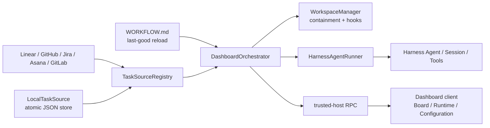

# 架构

## 目标

本项目保持 Symphony 的调度合同，同时不复制其语言、OTP 监督树或 Codex App Server 传输。Harness 是运行时，六种内建 TaskSource 提供任务边界，Dashboard 是观察、运行时控制与本地任务维护面。

## 核心边界

### TaskSource

`TaskIssue` 只要求项目级 `scopeRef`、opaque `nativeRef`、标识符、标题、状态、标签、阻塞关系和可调度性。Orchestrator 不解析任何 Provider ID，也不依赖某种 API shape。公开的 `TaskSourceRegistry` 允许继续注册其他 Provider，而无需修改调度内核。

任务源负责：

- 将 provider 数据归一化为 `TaskIssue`。
- 决定 provider-specific assignee 和 blocker 是否让任务可调度。
- 提供动态 `providerLabel · projectLabel` 上下文。
- 可选提供凭据状态、创建/更新/删除 capability 与 scoped Agent tool。
- Linear 注册 `linear_graphql`；四种 REST Provider 注册各自受路径约束的 API tool；Local 注册只读/更新任务的 `local_task`。

### WorkflowStore

`WORKFLOW.md` 必须包含一个 YAML frontmatter 和非空 Markdown prompt。启动时无有效版本会明确失败；运行中修改无效时保留最后一个有效版本，并将错误投影到 Configuration。

配置承担 scheduler policy，正文承担 model input。Agent 输入日志只记录字符数和 SHA-256 指纹，不记录 prompt 内容。

### DashboardOrchestrator

一个进程内通过经过编码的 `sourceKind:scopeRef:nativeRef` claim 防止重复运行。workspace 目录同样包含 Provider 和项目作用域，切换仓库或项目不会复用同编号任务的旧目录。每次 poll 执行：

1. 拉取 board 数据。
2. 对 running/retry/blocked 状态做 reconciliation。
3. 过滤 active、非 terminal、required labels、dispatchable 和到期 retry。
4. 按 priority、createdAt、identifier 排序。
5. 应用全局和按状态并发上限。
6. 准备工作区并启动 Harness Agent。

续跑达到 `max_turns` 且 issue 仍 active 时，1 秒后进入新一次调度尝试；运行失败则按 `min(10s × 2^(attempt-1), max_retry_backoff_ms)` 重试。

当前 claim 是进程内语义，尚不是跨 Harness 主机的分布式租约；多主机同时指向同一项目会有重复领取风险。

### WorkspaceManager

工作区按稳定的安全 leaf 保存，不按每次 retry 创建临时目录。若 identifier 需要净化，会附加前 16 位 SHA-256，避免不同原始标识符折叠到同一路径。

创建、进入和删除前都会检查 root/issue 的 symlink 和 containment。删除只发生在 issue 确认进入 terminal 状态后，并在 `before_remove` hook 之后重新验证目标。

### HarnessAgentRunner

每个 worker attempt 创建 Harness session，并显式应用：

- Harness 当前默认模型选择；
- 可选 Agent preset；
- 必填 permission preset；
- workspace cwd；
- 当前 TaskSource 提供的 scoped tool。

同一次 attempt 的多个 turn 复用同一 session。每个 turn 后重新读取任务源状态；terminal 触发清理，active 继续，inactive 停止但保留工作区。

### RPC 与客户端

Host 只注册 `/dsh-dashboard` trusted-host RPC，端点固定为：

- `state`
- `refresh`
- `issue`
- `pause`
- `stop`
- `createTask`
- `updateTask`
- `deleteTask`

客户端每 5 秒刷新 projection。Pause/Stop 只改变本地 orchestrator，不等价于修改远程任务；三个任务 mutation 端点只在当前 TaskSource 明确声明 capability 时可用，内建实现仅 Local 开放。Dashboard 通过 `sidebar.footer.action` 进入，通过 `shell.overlay` 显示，并可以把 inspector 的 Harness session 交还给原生 session UI。

## 状态所有权

| 状态 | 权威来源 | Dashboard 是否写入 |
| --- | --- | --- |
| 远程任务标题、状态、标签、关系 | 当前远程 TaskSource | 否 |
| Local 任务标题、描述、状态、优先级 | LocalTaskSource JSON store | 仅 capability-gated mutation |
| running、retry、blocked、token、event | Orchestrator + Harness session | Pause/Stop 仅改运行时 |
| workspace | 本地文件系统 | Agent/hook 正常写入；Dashboard 不写 |
| workflow | `WORKFLOW.md` | 否 |
| credential | Harness credential provider | 否，只显示脱敏状态 |

## 扩展原则

创建、更新与删除是 TaskSource 的显式可选 capability。UI 只在 capability 开启时显示操作；内建 LocalTaskSource 实现这些操作，远程 Provider 保持 Provider-native surface 为写入入口。Orchestrator 与 Board 不依赖 Local JSON schema，后续适配器可以独立选择是否实现 mutation capability。
